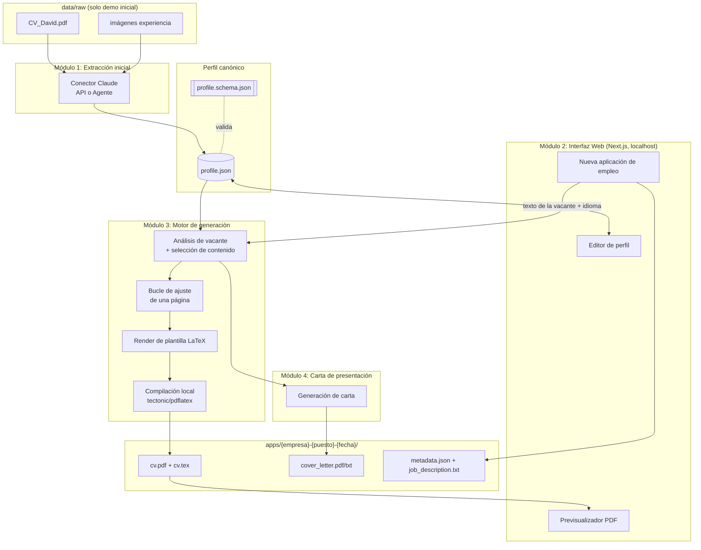
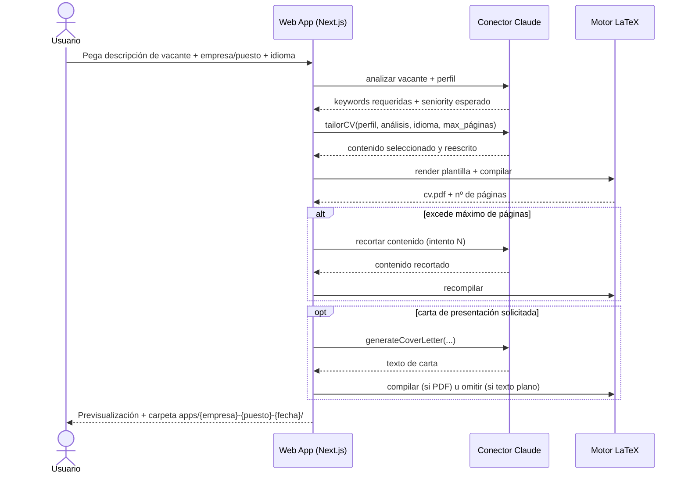

# Arquitectura del Sistema `update-cv`

**Repositorio:** `github.com/Deivs117/update-cv`
**Autor del diseño:** Claude (Anthropic), a solicitud de David Caicedo Samboni
**Fecha:** 2026-08-25
**Estado:** Diseño para construcción por agente (Claude Code u otro)

---

## 0. Resumen ejecutivo

`update-cv` es un sistema **100% local** (sin backend en la nube) que:

1. Extrae automáticamente los datos de un CV existente (PDF + imágenes) hacia un **perfil canónico en JSON**.
2. Permite editar ese perfil mediante una **interfaz web local** (Next.js, `localhost`).
3. Genera, **a demanda y por cada aplicación de empleo**, un **CV a la medida** de esa vacante específica (analizando el texto de la oferta), respetando reglas de longitud, formato ATS y bilingüismo (ES/EN).
4. Compila el CV en **LaTeX → PDF** con un compilador local (`tectonic` o `pdflatex`).
5. Opcionalmente genera una **carta de presentación** (PDF o texto para copiar/pegar).
6. Guarda cada aplicación en una carpeta nombrada por empresa/puesto/fecha, para trazabilidad.

El sistema debe funcionar para **cualquier usuario** que clone el repo (no solo para David): los datos de semilla (PDF + fotos actuales de David) son solo para la **demo inicial**.

---

## 1. Alcance

### 1.1 Demo inicial (Fase 1 — la que se construye primero)
- Repo con `data/raw/CV_David_Caicedo_Samboni.pdf` + imágenes de experiencia.
- Script/flujo que llama a Claude para leer ese PDF + imágenes y generar `data/profile.json`.
- Sin interfaz todavía obligatoria en esta fase — puede probarse por CLI/API directa. La interfaz web se construye en la fase 2.

### 1.2 Sistema completo (visión final)
- Interfaz web local completa (crear/editar perfil).
- Motor de generación de CV a medida por vacante.
- Generador de carta de presentación.
- Selección de idioma ES/EN.
- Regla de una página para ≤3 años de experiencia.
- Exportación LaTeX → PDF ATS-friendly.

---

## 2. Decisiones de diseño ya confirmadas (por David)

| Decisión | Elección |
|---|---|
| Interfaz interactiva | **Web app local** (React/Next.js, corre en `localhost`, sin servidor externo) |
| Conexión con Claude | **Ambos modos disponibles y configurables**: API directa (API key) y Claude Code como agente |
| Compilación LaTeX → PDF | **Compilador local** (`tectonic` recomendado, alternativa `pdflatex`/TeXLive) |

---

## 3. Supuestos de diseño (a confirmar o ajustar por David antes de construir)

Estos son puntos donde tomé una decisión razonable para poder entregar un diseño completo, pero **debes confirmarlos o corregirlos** antes de que el agente empiece a construir:

1. **Idioma canónico del perfil:** el `profile.json` se guarda en **español** (idioma nativo de David) como fuente de verdad. Cuando se genera un CV en inglés, Claude traduce/adapta el contenido en el momento de la generación, y el resultado se **cachea** dentro del propio `profile.json` (para no re-traducir cada vez y mantener consistencia de wording). *Si prefieres mantener campos bilingües manuales desde el inicio, es un cambio menor al schema.*
2. **Plantilla ATS-safe por defecto:** dado que el requisito de ATS es obligatorio, la plantilla LaTeX del CV **no llevará foto, columnas múltiples, iconos ni bloques de color** (a diferencia del diseño visual actual de dos columnas con foto). Es una plantilla de una sola columna, tipografía estándar, secciones claras, texto plano con viñetas. Esto es lo que hoy en día procesan mejor los parsers ATS. *Si quieres además una versión "visual" (como la actual) para enviar directo a un humano, la agrego como plantilla opcional secundaria — no obligatoria.*
3. **Las imágenes de experiencia** (fotos de proyectos, certificados, etc.) se usan **solo como fuente de información para la extracción inicial** (Claude las lee y saca texto/contexto), pero **no se insertan como imágenes dentro del CV final** (por compatibilidad ATS). Si en algún momento quieres un portafolio visual aparte, sería una salida distinta (ej. una página web de portafolio), fuera del alcance de este documento.
4. **Umbral de "años de experiencia"** para la regla de una página se calcula automáticamente sumando los rangos de fechas de `experience[]` en el perfil (deduplicando solapamientos), con opción de que el usuario lo sobreescriba manualmente en la interfaz.
5. **Multi-usuario:** el diseño ya es "multi-usuario" en el sentido de que cualquiera puede clonar el repo y llenar su propio `profile.json` desde cero vía la interfaz — no hay nada hardcodeado a David salvo los datos de semilla en `data/raw/`.

---

## 4. Arquitectura general



---

## 5. Estructura de carpetas del repositorio

```
update-cv/
├── data/
│   ├── raw/                          # Semilla SOLO para la demo (PDF + imágenes)
│   │   ├── CV_David_Caicedo_Samboni.pdf
│   │   └── images/
│   │       ├── proyecto_salli_01.jpg
│   │       └── ...
│   ├── profile.json                  # Perfil canónico del usuario (fuente de verdad)
│   └── profile.schema.json           # JSON Schema de validación
│
├── apps/                             # Salidas: una carpeta por cada aplicación de empleo
│   └── {empresa}-{puesto}-{YYYYMMDD}/
│       ├── job_description.txt       # Texto de la vacante (guardado para auditoría)
│       ├── cv.tex
│       ├── cv.pdf
│       ├── cover_letter.tex          # (si aplica)
│       ├── cover_letter.pdf          # (si aplica)
│       ├── cover_letter.txt          # (si se pidió modo copiar/pegar)
│       └── metadata.json             # idioma, modelo usado, fecha, versión de plantilla, etc.
│
├── templates/
│   └── latex/
│       ├── cv-es.tex.tpl             # Plantilla ATS-safe en español
│       ├── cv-en.tex.tpl             # Plantilla ATS-safe en inglés
│       ├── cover-letter-es.tex.tpl
│       └── cover-letter-en.tex.tpl
│
├── web/                               # Aplicación Next.js (interfaz local)
│   ├── app/                           # App Router
│   │   ├── perfil/                    # Editor de perfil
│   │   ├── nueva-aplicacion/          # Wizard: pegar vacante → generar CV
│   │   └── aplicaciones/              # Historial de aplicaciones generadas
│   ├── components/
│   ├── lib/
│   │   ├── claude/
│   │   │   ├── connector.interface.ts     # Contrato común (API y Agente)
│   │   │   ├── api-connector.ts           # Implementación vía Anthropic SDK
│   │   │   └── agent-connector.ts         # Implementación vía handoff a Claude Code
│   │   ├── latex/
│   │   │   ├── render.ts                  # Rellena plantillas .tpl
│   │   │   ├── compile.ts                 # Ejecuta tectonic/pdflatex
│   │   │   └── page-count.ts              # Verifica número de páginas del PDF
│   │   ├── experience-years.ts            # Calcula años de experiencia
│   │   └── validation/
│   │       └── profile.zod.ts             # Espejo TypeScript del JSON Schema
│   ├── public/
│   └── package.json
│
├── .claude-tasks/                     # Buzón de tareas para el modo "Agente" (gitignored)
│   ├── pending/
│   └── done/
│
├── .env.example
├── .gitignore
├── CLAUDE.md                          # Instrucciones para Claude Code cuando opera en modo agente
└── README.md
```

---

## 6. Modelo de datos

### 6.1 `profile.json` — Perfil canónico

```jsonc
{
  "personal": {
    "full_name": "David Caicedo Samboni",
    "headline": "Mechatronics Engineer specialized in AI",
    "age": 24,
    "photo_path": "data/raw/images/foto_perfil.jpg",
    "location": "Cali, Colombia",
    "phone": "+57 310 331 9477",
    "email": "davidcaicedosamboni@gmail.com",
    "website": "https://deivs117.github.io/portfolio/",
    "social_networks": [
      { "platform": "linkedin", "url": "https://www.linkedin.com/in/davidcaicedo-flux-solutions" },
      { "platform": "github", "url": "https://github.com/Deivs117" },
      { "platform": "instagram", "url": "https://instagram.com/fluxsolutionscali" }
    ]
  },
  "summary": {
    "es": "Ingeniero mecatrónico especializado en hardware, software y datos...",
    "en": "Mechatronics engineer specializing in hardware, software, and data..."
  },
  "founded_companies": [
    {
      "name": "Flux Solutions Cali",
      "role": "Cofundador",
      "url": "https://instagram.com/fluxsolutionscali",
      "description": "Lidera todo el flujo de manufactura sustractiva CNC del negocio."
    }
  ],
  "education": [
    {
      "id": "edu-1",
      "institution": "Universidad Autónoma de Occidente",
      "degree": "Ingeniería Mecatrónica",
      "start_date": "2021-01",
      "end_date": "2026-01",
      "location": "Cali, Colombia"
    },
    {
      "id": "edu-2",
      "institution": "Universidad Autónoma de Occidente",
      "degree": "Especialización en Inteligencia Artificial",
      "start_date": "2026-01",
      "end_date": "2026-10"
    }
  ],
  "experience": [
    {
      "id": "exp-1",
      "company": "Flux Solutions Cali",
      "role": "Lead Mechatronics Engineer",
      "start_date": "2026-01",
      "end_date": "present",
      "location": "Cali, Colombia",
      "bullets": [
        {
          "id": "exp-1-b1",
          "text_es": "Diseñé e implementé un backend serverless en Azure para telemetría industrial en tiempo real...",
          "text_en": "Designed and implemented an Azure serverless backend for real-time industrial telemetry...",
          "keywords": ["azure", "iot", "telemetry", "predictive maintenance"]
        }
      ]
    }
  ],
  "projects": [
    {
      "id": "proj-salli",
      "name": "SALLI: Salamander Autonomous Locomotion on Land Infrastructure",
      "date": "2025",
      "bullets": [ { "id": "proj-salli-b1", "text_es": "...", "text_en": "...", "keywords": ["ros", "esp32", "cnn"] } ]
    }
  ],
  "technical_skills": [
    { "category": "Edge AI & Embedded Vision", "items": ["Edge Impulse", "ESP32", "ESP-CAM"] },
    { "category": "Programming Languages", "items": ["C++", "C", "C#", "Python", "JavaScript", "SQL", "Bash"] }
  ],
  "soft_skills": ["Cross-Functional Leadership", "Research-Driven Problem Solving"],
  "languages": [
    { "language": "Spanish", "level": "Native" },
    { "language": "English", "level": "B2" }
  ],
  "certifications_compliance": ["ISO 9001", "ISO 10218", "ISO/TS 15066", "ISO 13482", "ISO/IEC 42001"],
  "meta": {
    "schema_version": "1.0",
    "last_updated": "2026-08-25T00:00:00Z"
  }
}
```

**Notas de diseño del schema:**
- Cada `bullet` tiene **id propio** → así el motor de generación puede referenciar/seleccionar/reordenar bullets específicos sin reescribir texto libre cada vez, y puede cachear traducciones (`text_es` / `text_en`) sin perder trazabilidad.
- `keywords` por bullet (opcional, puede llenarlas Claude automáticamente en la extracción) ayuda al **matching contra la descripción de la vacante** sin depender 100% de una llamada a Claude por cada selección — se puede hacer un primer filtro barato por keywords y luego afinar con Claude.
- `profile.schema.json` (JSON Schema estándar) valida este archivo tanto en el editor web como en el pipeline de generación, para evitar que un JSON mal formado rompa la compilación LaTeX a mitad de proceso.

---

## 7. Módulo 1 — Extracción inicial (PDF + imágenes → JSON)

### 7.1 Flujo
1. El usuario coloca su CV (PDF) e imágenes en `data/raw/`.
2. Se ejecuta la extracción (desde la web app, botón "Importar desde data/raw", o desde CLI en la demo inicial).
3. El conector de Claude (ver 7.2/7.3) recibe el PDF + imágenes y un prompt de extracción estructurada, y devuelve un JSON que cumple `profile.schema.json`.
4. El resultado se muestra en el **editor de perfil** para revisión humana antes de guardarse como `profile.json` definitivo — **nunca se sobreescribe el perfil automáticamente sin confirmación del usuario**.

### 7.2 Modo API (Anthropic API directa)
- Requiere `ANTHROPIC_API_KEY` en `.env`.
- El backend de Next.js (API route del lado servidor, nunca expuesta al cliente) llama al SDK de Anthropic (`@anthropic-ai/sdk`), enviando el PDF y las imágenes como bloques `document`/`image` en base64 (ver sección de `anthropic_api_in_artifacts` — mismo patrón: multi-modal input, `max_tokens` fijo, salida forzada en JSON estricto sin texto adicional).
- Ventaja: totalmente automático, sin intervención manual.

### 7.3 Modo Agente (Claude Code)
- No hay llamada API propia. En su lugar:
  1. La web app escribe una tarea en `.claude-tasks/pending/{task_id}.json`, con el contrato: `{ "type": "extract_profile", "input_pdf": "...", "input_images": [...], "output_path": ".claude-tasks/done/{task_id}.result.json" }`.
  2. El usuario, en una terminal donde tenga Claude Code corriendo dentro del repo, ejecuta un comando (documentado en `CLAUDE.md`) que le pide a Claude Code procesar las tareas pendientes en `.claude-tasks/pending/`.
  3. Claude Code lee el PDF/imágenes, genera el JSON, y lo escribe en `output_path`.
  4. La web app detecta el archivo de resultado (polling simple o botón "Revisar resultado") y continúa el flujo igual que en modo API.
- Ventaja: no requiere API key ni gasto por token aparte de tu plan de Claude ya existente.

### 7.4 Contrato común de salida
Ambos conectores implementan la misma interfaz TypeScript (`connector.interface.ts`), de modo que el resto del sistema (editor, motor de generación) **no necesita saber cuál de los dos modos se usó**:

```ts
interface ClaudeConnector {
  extractProfile(input: { pdfPath: string; imagePaths: string[] }): Promise<ProfileDraft>;
  tailorCV(input: { profile: Profile; jobDescription: string; language: "es" | "en" }): Promise<TailoredContent>;
  generateCoverLetter(input: { profile: Profile; jobDescription: string; language: "es" | "en" }): Promise<string>;
}
```

---

## 8. Módulo 2 — Interfaz web local (Next.js)

### 8.1 Vistas principales
| Ruta | Función |
|---|---|
| `/perfil` | Editor completo del `profile.json`: datos personales, foto, redes, experiencia, educación, skills, idiomas, empresas fundadas. Botón "Importar desde PDF/imágenes" que dispara el Módulo 1. |
| `/nueva-aplicacion` | Wizard de 3 pasos: (1) pegar texto de la vacante + nombre de empresa/puesto, (2) elegir idioma (ES/EN) y si se genera carta de presentación (y en qué formato: PDF o texto), (3) generar → muestra progreso → previsualización del PDF resultante. |
| `/aplicaciones` | Historial: lista todas las carpetas de `apps/`, con acceso rápido a abrir el PDF, ver la vacante original, o regenerar. |

### 8.2 Componentes clave
- **Editor de experiencia**: lista editable de bullets por experiencia/proyecto, con drag-and-drop para reordenar prioridad por defecto.
- **Selector de modo Claude**: toggle API / Agente / según configuración global, disponible también como override puntual en `/nueva-aplicacion`.
- **Visor de PDF embebido** (iframe o `<embed>`) para previsualizar `cv.pdf` sin salir de la app.
- **Editor de LaTeX crudo (avanzado)**: opción de "editar .tex manualmente y recompilar" para ajustes finos de último minuto, sin pasar de nuevo por Claude.

### 8.3 Validación
- `profile.zod.ts` valida en tiempo real el formulario del editor (mismos campos que `profile.schema.json`).
- Antes de cualquier generación de CV, se valida que el perfil tenga al menos: nombre, un email, y al menos una experiencia o proyecto.

### 8.4 Persistencia
- Todo en el sistema de archivos local (no hay base de datos). `profile.json` se sobreescribe con cada guardado desde el editor (se recomienda que el propio repo Git funcione como historial de versiones del perfil).

---

## 9. Módulo 3 — Motor de generación de CV a medida

### 9.1 Entradas
- `profile.json` (perfil completo)
- Texto de la vacante (pegado por el usuario)
- Idioma destino (`es` | `en`)
- Nombre de empresa y puesto (para nombrar la carpeta de salida)
- Máximo de páginas: calculado automáticamente (ver 9.4) con opción de override manual

### 9.2 Paso 1 — Análisis de la vacante
Se envía a Claude (vía el conector activo) un prompt que:
- Extrae de la vacante: habilidades técnicas requeridas, habilidades blandas, palabras clave del sector/empresa, seniority esperado.
- Devuelve esta info estructurada (para mostrarla también en la UI como "resumen de lo que pide la vacante").

### 9.3 Paso 2 — Selección y priorización de contenido
- Con el análisis de la vacante + el `profile.json` completo, Claude selecciona **qué bullets de experiencia/proyectos incluir y en qué orden**, y **reescribe/adapta el wording** de cada bullet seleccionado para alinearlo con el lenguaje y las keywords de la vacante (esto es clave para ATS: coincidencia léxica, no solo semántica).
- Salida: `TailoredContent` = lista ordenada de secciones con los bullets finales (texto ya en el idioma destino), skills reordenados por relevancia, resumen/summary reescrito para esa vacante.

### 9.4 Regla de una página (≤3 años de experiencia)
- `experience-years.ts` calcula automáticamente la experiencia total en años a partir de los rangos de fechas en `experience[]` (uniendo solapamientos).
- Si el resultado es **≤ 3 años → máximo 1 página**. Si es mayor, se permite hasta 2 páginas (ajustable).
- Este máximo se pasa como restricción dura al Paso 2 (Claude debe recortar contenido para caber) y se **verifica de forma determinística** después de compilar (ver 9.6), no solo confiando en que el modelo "calculó bien".

### 9.5 Plantillas LaTeX ATS-safe
- Una columna, sin tablas, sin imágenes, sin color de fondo, sin iconos, fuente estándar (ej. Latin Modern o Helvetica vía `\usepackage{helvet}`), secciones con encabezados simples (`\section*{Experiencia}`), viñetas con `itemize` estándar.
- Dos plantillas base: `cv-es.tex.tpl` y `cv-en.tex.tpl`, con placeholders tipo `{{PERSONAL.FULL_NAME}}`, `{{EXPERIENCE_SECTION}}`, etc.
- `render.ts` hace el reemplazo de placeholders, **escapando correctamente caracteres especiales de LaTeX** (`&`, `%`, `_`, `#`, etc.) para evitar errores de compilación con datos reales (ej. "C#", "ISO/IEC 42001").

### 9.6 Compilación y bucle de ajuste de página
1. `compile.ts` ejecuta `tectonic cv.tex` (o `pdflatex` como fallback) en un proceso hijo, dentro de la carpeta de salida de la aplicación.
2. `page-count.ts` verifica el número real de páginas del PDF resultante (ej. usando `pdf-lib` o `pdfinfo`).
3. Si excede el máximo permitido:
   - Se vuelve a llamar a Claude con instrucción explícita de recortar (quitar los bullets de menor relevancia calculada, acortar el summary, etc.), hasta **3 intentos**.
   - Si tras 3 intentos sigue sin caber, se recorta de forma determinística (se eliminan los bullets con menor `keywords` match) y se **avisa al usuario en la UI** que hubo recorte automático forzado, mostrando qué se quitó.

### 9.7 Nomenclatura y contenido de salida
Carpeta: `apps/{empresa-normalizada}-{puesto-normalizado}-{YYYYMMDD}/`
- `cv.tex`, `cv.pdf`
- `job_description.txt` (para poder regenerar o auditar después qué vacante originó ese CV)
- `metadata.json`: idioma, modo de Claude usado (api/agente), modelo, número de páginas final, si hubo recorte forzado, timestamp.

---

## 10. Módulo 4 — Carta de presentación

- Opcional, activable en el wizard de `/nueva-aplicacion`.
- Usa el mismo análisis de vacante del Módulo 3 (no se re-analiza la vacante dos veces).
- Formatos de salida, a elección del usuario:
  - **PDF** vía plantilla LaTeX (`cover-letter-{es|en}.tex.tpl`), mismo pipeline de compilación.
  - **Texto plano para copiar/pegar** (se guarda como `cover_letter.txt` y se muestra en un `<textarea>` con botón "Copiar" en la UI, sin necesidad de compilar nada).

---

## 11. Selección de idioma

- Selector explícito ES/EN en `/nueva-aplicacion` (no se infiere automáticamente del texto de la vacante, para evitar errores — aunque se puede sugerir un default basado en el idioma detectado de la vacante pegada).
- Afecta: plantilla LaTeX usada, idioma del contenido generado por Claude, e idioma de la carta de presentación.

---

## 12. Configuración del sistema

`.env.example`:
```
# Requerido solo si CLAUDE_MODE incluye "api"
ANTHROPIC_API_KEY=

# api | agent | both
CLAUDE_MODE=both

# Modelo a usar en modo API
CLAUDE_MODEL=claude-sonnet-5

# es | en
DEFAULT_LANGUAGE=es

# Umbral de años de experiencia para forzar 1 página
JUNIOR_EXPERIENCE_YEARS_THRESHOLD=3

# Máximo de páginas si se supera el umbral anterior
MAX_PAGES_SENIOR=2

# Reintentos del bucle de ajuste de página
MAX_LATEX_FIT_RETRIES=3

# Binario de compilación LaTeX: tectonic | pdflatex
LATEX_ENGINE=tectonic
```

---

## 13. Seguridad y privacidad

- Todo el sistema corre **localmente**; no hay backend externo ni base de datos remota.
- `ANTHROPIC_API_KEY` nunca se expone al cliente (solo se usa en API routes del lado servidor de Next.js).
- `.gitignore` debe excluir: `.env`, `.claude-tasks/`, y opcionalmente `apps/` (las aplicaciones generadas pueden contener datos sensibles de vacantes específicas y no necesitan versionarse).
- `data/raw/` (el PDF y fotos de semilla) puede quedarse versionado solo en la demo inicial de David; para otros usuarios que clonen el repo, se recomienda **no** subir sus propios datos personales al repositorio público — usar un repo privado o mantener `data/` fuera de git tras la configuración inicial.

---

## 14. Flujo end-to-end (secuencia)



---

## 15. Stack tecnológico (resumen)

| Capa | Tecnología |
|---|---|
| Interfaz | Next.js (React) + TypeScript, corre en `localhost` |
| Validación | Zod (espejo del JSON Schema) |
| Conexión a Claude (modo API) | `@anthropic-ai/sdk` |
| Conexión a Claude (modo Agente) | Buzón de archivos `.claude-tasks/` + `CLAUDE.md` con instrucciones |
| Generación de documentos | LaTeX (plantillas propias, ATS-safe) |
| Compilación | `tectonic` (recomendado, no requiere TeXLive completo) o `pdflatex` |
| Verificación de páginas | `pdf-lib` o `pdfinfo` |
| Persistencia | Sistema de archivos local (JSON + carpetas), sin base de datos |

---

## 16. Roadmap de implementación (fases sugeridas para el agente)

1. **Fase 0 — Setup:** estructura de carpetas, `.env.example`, instalación de `tectonic`, README con instrucciones de arranque.
2. **Fase 1 — Extracción (demo):** `profile.schema.json`, conector API mínimo, script que procese `data/raw/` → `profile.json` revisable.
3. **Fase 2 — Interfaz de perfil:** `/perfil` con CRUD completo sobre `profile.json`.
4. **Fase 3 — Plantillas y compilación:** plantillas LaTeX ATS-safe ES/EN + pipeline `render.ts` + `compile.ts` + `page-count.ts`, probado con un perfil de ejemplo estático (sin IA todavía).
5. **Fase 4 — Motor de generación a medida:** `/nueva-aplicacion`, análisis de vacante, selección/reescritura de contenido, bucle de ajuste de página.
6. **Fase 5 — Carta de presentación.**
7. **Fase 6 — Modo Agente:** implementar `agent-connector.ts` + `CLAUDE.md` + buzón `.claude-tasks/`.
8. **Fase 7 — Pulido:** historial en `/aplicaciones`, editor LaTeX avanzado, manejo de errores de compilación visibles en UI.

---

## 17. Preguntas abiertas para cuando el agente empiece a construir

Estas no bloquean el diseño, pero conviene decidirlas durante la implementación:

1. ¿`tectonic` se instala como binario del sistema o se vendoriza dentro del repo para que "simplemente funcione" al clonar?
2. ¿El historial de `/aplicaciones` necesita búsqueda/filtrado, o basta con lista simple ordenada por fecha?
3. ¿Se quiere un modo "diff" en el editor de perfil para ver qué cambió Claude al reescribir un bullet respecto al original, antes de aceptarlo?
4. ¿La foto de perfil (`photo_path`) se guarda solo por completitud de datos aunque no se use en el CV ATS, o se elimina del schema si nunca se va a usar?

---

*Fin del documento. Este archivo está listo para entregarse a un agente constructor (ej. Claude Code) como especificación de arquitectura del repositorio `update-cv`.*