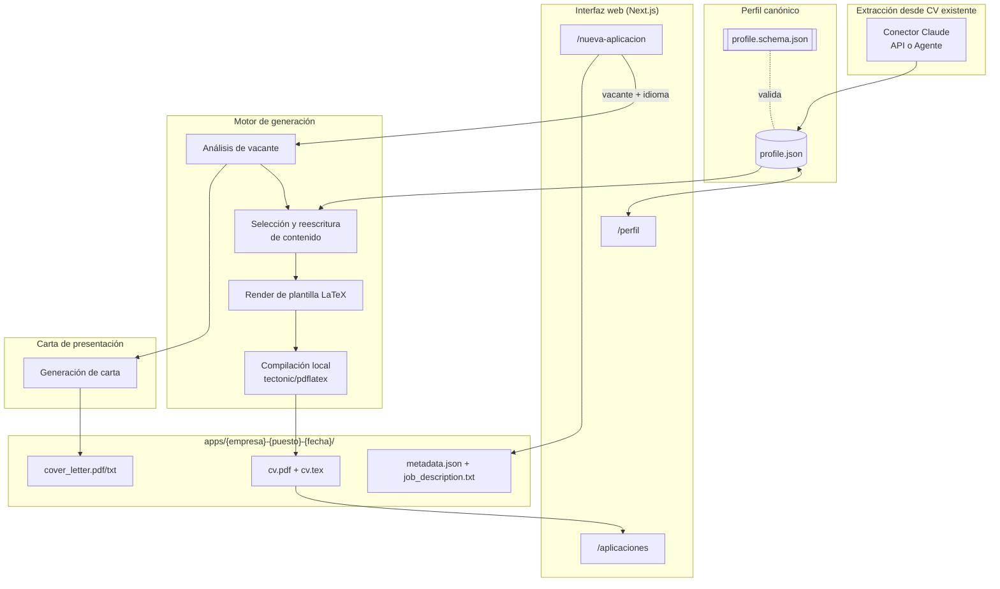

# update-cv

Sistema que genera **CVs y cartas de presentación a la medida de cada vacante**, a partir de
un perfil profesional canónico. Cada aplicación se analiza contra el texto real de la oferta,
se reescribe con el vocabulario de esa vacante específica (clave para el matching léxico de
los ATS), se compila a PDF vía LaTeX, y queda archivada en su propia carpeta con la vacante
original guardada junto al resultado, para trazabilidad.

Corre localmente sobre Next.js. No depende de una base de datos: el perfil vive en un único
JSON versionable y cada aplicación generada es una carpeta autocontenida en el sistema de
archivos.

## Qué hace

- **Perfil canónico único** (`data/profile.json`): datos personales, experiencia, proyectos,
  educación, skills técnicas y blandas, idiomas y certificaciones — con bullets bilingües
  (`text_es`/`text_en`) e ids estables por bullet, para poder seleccionarlos, reordenarlos y
  reescribirlos sin perder trazabilidad hacia el dato original.
- **Extracción automática desde un CV existente**: lee un PDF (y opcionalmente imágenes de
  apoyo) y produce un borrador de perfil estructurado, revisable antes de guardarse — nunca
  sobreescribe el perfil real sin confirmación explícita del usuario.
- **Editor de perfil** (`/perfil`): CRUD completo sobre el JSON canónico, con validación en
  tiempo real (Zod) y reordenado de bullets/listas.
- **Generación de CV a la medida** (`/nueva-aplicacion`): wizard de 3 pasos — pegar la
  vacante → elegir idioma y opciones → generar. El motor:
  1. Analiza la vacante (skills técnicas, soft skills, keywords de sector, seniority),
     siempre en el mismo idioma en que está escrita la oferta.
  2. Selecciona y reescribe los bullets, skills, soft skills y certificaciones relevantes
     para esa vacante específica, **sin inventar tecnologías ni logros** que no estén en el
     perfil — la respuesta del modelo se resuelve de vuelta contra el perfil real por `id`,
     así que una alucinación nunca puede corromper datos estructurales (empresa, fechas,
     etc.), solo el texto y el orden de lo que ya existe.
  3. Renderiza la plantilla LaTeX correspondiente y compila el PDF localmente.
  4. Verifica el número real de páginas del PDF resultante y lo muestra como
     retroalimentación en la UI frente a la recomendación por años de experiencia (el límite
     es orientativo, no bloquea la generación).
- **Carta de presentación opcional**: reutiliza el mismo análisis de vacante que el CV (no
  se re-analiza dos veces), genera solo el cuerpo del texto (2-4 párrafos, sin inventar
  logros), y se entrega como PDF compilado o como texto plano para copiar/pegar.
- **Historial de aplicaciones** (`/aplicaciones`): lista cada aplicación generada con acceso
  directo a la vacante original y al detalle.
- **Detalle de aplicación** (`/aplicaciones/[slug]`): previsualización embebida del PDF,
  botón "Regenerar con mi perfil actual" (re-corre todo el pipeline reusando la misma
  carpeta, útil tras editar el perfil), y un editor de LaTeX avanzado para ajustes finos de
  último minuto sin volver a llamar al modelo — con el log de compilación completo visible
  en la UI si algo falla.
- **Dos formas de conectar con el modelo**, intercambiables por variable de entorno o desde
  la propia interfaz:
  - **Modo API**: llamadas directas a la API de Anthropic (`ANTHROPIC_API_KEY`).
  - **Modo Agente**: sin API key. La web app escribe la tarea en un buzón de archivos
    (`.claude-tasks/pending/`) y Claude Code —corriendo en una terminal del usuario dentro
    del repo, ya sea a pedido o mediante un watcher automático (`npm run agent:watch`)—
    la procesa y devuelve el resultado en `.claude-tasks/done/`. Ambos modos implementan el
    mismo contrato (`ClaudeConnector`), así que el resto del sistema no distingue cuál se
    usó.
- **Generación no bloqueante**: analizar una vacante o generar un CV encola un job y devuelve
  de inmediato; el cliente hace polling y ve el progreso en vivo (`Analizando...`,
  `Adaptando tu contenido...`, `Compilando el PDF...`) sin dejar la pestaña colgada.

## Arquitectura



### Conectores con el modelo (API / Agente)

Ambos modos implementan la misma interfaz, de modo que el editor y el motor de generación no
necesitan saber cuál está activo:

```ts
interface ClaudeConnector {
  extractProfile(input: { pdfPath: string; imagePaths: string[] }): Promise<ProfileDraft>;
  analyzeJob(input: { jobDescription: string }): Promise<JobAnalysis>;
  tailorCV(input: { profile: Profile; jobAnalysis: JobAnalysis; language: "es" | "en" }): Promise<TailoredContent>;
  generateCoverLetter(input: { ... }): Promise<string>;
}
```

- **`web/lib/claude/api-connector.ts`**: llama al SDK de Anthropic desde el servidor de
  Next.js (la API key nunca se expone al cliente).
- **`web/lib/claude/agent-connector.ts`**: escribe la tarea en
  `.claude-tasks/pending/{task_id}.json`, espera (polling) el resultado en
  `.claude-tasks/done/{task_id}.result.json`, y reintenta el parseo del archivo unos
  segundos si lo encuentra a medio escribir antes de darlo por corrupto. `CLAUDE.md` en la
  raíz del repo documenta el contrato exacto de cada tipo de tarea para que Claude Code lo
  procese con el mismo criterio que el modo API (mismos prompts, en `web/lib/claude/prompts.ts`).
- **`npm run agent:watch`**: vigila el buzón y usa el CLI headless de Claude Code
  (`claude -p`) para resolver cada tarea automáticamente en cuanto aparece, sin que haya que
  pedirlo a mano cada vez.
- **`web/lib/claude/get-connector.ts`**: elige el conector activo según `CLAUDE_MODE` en
  `.env`, con posibilidad de override puntual desde la UI.

### Plantillas y compilación LaTeX

- `templates/latex/cv-{es,en}.tex.tpl`: plantillas **ATS-safe** — una columna, sin tablas,
  iconos ni imágenes, tipografía estándar. `web/lib/latex/render.ts` las rellena escapando
  correctamente los caracteres especiales de LaTeX (`&`, `%`, `_`, `#`, `$`, etc.).
- `templates/latex/cv-visual.tex.tpl`: plantilla secundaria con foto, iconos y color, para
  enviar directo a un humano (**no ATS-safe**, no usar para aplicar por sistemas
  automatizados).
- `templates/latex/cover-letter-{es,en}.tex.tpl`: misma línea visual de una columna que el
  CV ATS-safe.
- `web/lib/latex/compile.ts` ejecuta `tectonic` (o `pdflatex` si `LATEX_ENGINE=pdflatex`) y
  guarda el log completo de compilación junto al PDF, tanto en éxito como en fallo.
- `web/lib/latex/page-count.ts` verifica el número real de páginas del PDF compilado con
  `pdf-lib`.

## Estructura del repositorio

```
update-cv/
├── data/
│   ├── raw/                    # CV fuente (PDF + imágenes) para la extracción inicial
│   ├── profile.json            # Perfil canónico (fuente de verdad)
│   ├── profile.draft.json      # Borrador de la última extracción, pendiente de revisión
│   └── profile.schema.json     # JSON Schema del perfil
├── apps/                       # Una carpeta por cada aplicación de empleo generada
│   └── {empresa}-{puesto}-{YYYYMMDD}/
│       ├── job_description.txt
│       ├── cv.tex / cv.pdf
│       ├── cover_letter.tex / .pdf / .txt   (si aplica)
│       └── metadata.json
├── templates/latex/             # Plantillas .tex.tpl ATS-safe y visual
├── web/                         # Aplicación Next.js
│   ├── app/                     # Rutas: /perfil, /nueva-aplicacion, /aplicaciones, /api/*
│   ├── components/
│   ├── lib/
│   │   ├── claude/               # Conectores API/Agente, prompts, contrato común
│   │   ├── latex/                 # render, compile, page-count
│   │   ├── validation/            # profile.zod.ts, generation.zod.ts
│   │   ├── tailoring.ts           # arma el contenido enviado a Claude y resuelve la
│   │   │                          # respuesta de vuelta contra el perfil real por id
│   │   ├── generation-pipeline.ts # orquesta analizar → adaptar → renderizar → compilar
│   │   ├── jobs.ts                # cola de jobs en memoria (generación no bloqueante)
│   │   └── experience-years.ts    # calcula años de experiencia para la recomendación de páginas
│   └── scripts/                  # extract-profile, test-latex-pipeline, agent-watch
├── .claude-tasks/                # Buzón de tareas del modo Agente (gitignored)
├── CLAUDE.md                     # Contrato de tareas para Claude Code en modo Agente
└── README.md
```

## Requisitos

- Node.js 20+ y npm (probado con Node 26 / npm 11).
- `tectonic` instalado en el sistema (compilador LaTeX). Alternativa: `pdflatex` (TeXLive).
  - Arch Linux: `sudo pacman -S tectonic` (o `paru -S tectonic-bin` desde AUR si el mirror
    falla).
  - Otras plataformas: https://tectonic-typesetting.github.io/en-US/install.html
- Una `ANTHROPIC_API_KEY` si vas a usar el modo API (no es necesaria si solo usas el modo
  Agente vía Claude Code). Se obtiene en https://console.anthropic.com/

## Arranque

```bash
git clone <este-repo>
cd update-cv

cp .env.example .env
# Edita .env y agrega tu ANTHROPIC_API_KEY si vas a usar modo API

cd web
npm install
npm run dev
# http://localhost:3000

# Opcional: si vas a usar modo Agente (sin ANTHROPIC_API_KEY), en otra terminal,
# para que las tareas se procesen solas sin pedírselo a Claude Code cada vez:
npm run agent:watch
```

### Configuración (`.env`)

| Variable | Descripción |
|---|---|
| `ANTHROPIC_API_KEY` | Requerida solo si `CLAUDE_MODE` incluye `api`. |
| `CLAUDE_MODE` | `api` \| `agent` \| `both`. |
| `CLAUDE_MODEL` | Modelo a usar en modo API. |
| `DEFAULT_LANGUAGE` | `es` \| `en`. |
| `JUNIOR_EXPERIENCE_YEARS_THRESHOLD` | Años de experiencia bajo los cuales se recomienda 1 página. |
| `MAX_PAGES_SENIOR` | Máximo de páginas recomendado por encima del umbral anterior. |
| `LATEX_ENGINE` | `tectonic` \| `pdflatex`. |
| `AGENT_POLL_INTERVAL_MS` / `AGENT_TASK_TIMEOUT_MS` | Frecuencia de polling y timeout del modo Agente desde la web app. |
| `AGENT_WATCH_POLL_INTERVAL_MS` / `AGENT_WATCH_TASK_TIMEOUT_MS` / `AGENT_WATCH_CLAUDE_BIN` | Configuración del watcher (`npm run agent:watch`). |

## Contribuir

Los commits y los títulos de PR siguen [Conventional Commits](https://www.conventionalcommits.org/)
(`tipo(área): mensaje`), con `tipo` uno de: `feat, fix, chore, docs, refactor, test, style,
perf, ci`. Esto se valida de dos formas:

- **Localmente**, con un hook `commit-msg` de [pre-commit](https://pre-commit.com/)
  (`.pre-commit-config.yaml`, hook `conventional-pre-commit`). Instalación (una vez por
  clon):

  ```bash
  # Instala pre-commit si no lo tenés (elegí una):
  pipx install pre-commit
  # o
  uv tool install pre-commit

  # Dentro del repo:
  pre-commit install --hook-type commit-msg
  ```

- **En CI**, el workflow `.github/workflows/pr-title.yml` valida el título del PR con los
  mismos tipos permitidos — sirve de espejo para quien no tenga el hook instalado
  localmente.

## Usar tus propios datos

- `data/raw/` trae como semilla un CV de ejemplo solo para la demo inicial. Reemplaza su
  contenido (PDF + imágenes) con tu propio CV para usar el sistema con tus datos.
- `data/profile.json` es tu perfil canónico; se crea y edita desde `/perfil`, o a partir del
  borrador que genera la extracción inicial (`cd web && npm run extract-profile`, o el botón
  "Importar desde PDF/imágenes" dentro del editor).
- Nada del sistema está hardcodeado a un usuario específico: cualquiera que clone el repo
  puede llenar su propio perfil desde cero.

## Seguridad y privacidad

- El sistema corre localmente: no hay backend externo ni base de datos remota.
- `ANTHROPIC_API_KEY` solo se usa del lado del servidor (API routes de Next.js), nunca se
  expone al cliente.
- `.env` y `.claude-tasks/` están fuera de control de versiones. `apps/` también está
  gitignored por defecto, ya que cada aplicación generada guarda el texto completo de una
  vacante específica.
- `GET /api/apps/[...path]` (usado para previsualizar PDFs/`.tex` embebidos) está
  restringido a la carpeta `apps/`, sin permitir path traversal fuera de ella.
